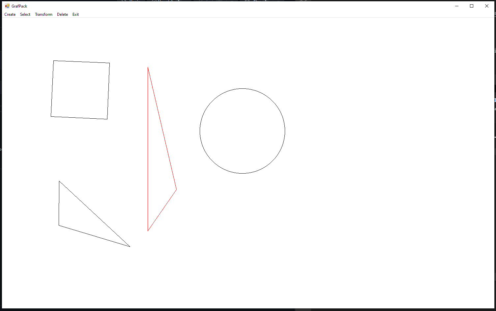

# Cristin's Homepage

[https://github.com/cr1d3v](https://github.com/cr1d3v)

## The Project Idea

This is a [WinForms](https://learn.microsoft.com/en-us/visualstudio/ide/create-csharp-winform-visual-studio?view=vs-2022) shape-drawing application. The application can create, select, transform and delete various shapes with these shapes referenced in an array. The different shapes are all defined as separate classes which inherit from a class Shape. The primary requirement of the following project was to not use the drawing and processing features of the WinForms GDI or WPF but perform the operations from first principles using pure code as much as possible.

The following application was part of my Y3 assignment at University therefore within the CGPMain folder there's also a pdf file called 'presentation' which showcases the thought process behind the application in more detail.

There's also a practiseExercises folder that also contains 5 other folders with 5 other application accordingly that were part of my weekly practise exercise routine along with once again a pdf file called 'presentation' which showcases the thought process behind the weekly exercises in a more detailed approach.

## Tech Stack

- [C#](https://learn.microsoft.com/en-us/dotnet/csharp/tour-of-csharp/) - A general-purpose programming language designed by  Microsoft.

## Demo

## User Guide on How to Run the Application ?

To run the application, follow the steps bellow:

Step 1: Navigate towards the following directory path ../2D-Drawing-Application/CGPMain/MainApp/CGP-SID1903999.exe
Step 2: Execute the .exe file!

Alternatively, to inspect the code:
 
Access: ../2D-Drawing-Application/CGPMain/MainApp folder
 
This is where all of the .cs files live such as:
* GrafPack.cs,
* GrafPack.Designer.cs,
* Utilities.cs,
* Utilities.Designer.cs

## User Guide on Application Controls ? 

On the top left corner of the application there are 5 selectable options!
* Create -> Square, Circle, Triangle
  * Select a shape then follow the given instructions on the screen!
* Select -> click on the already drawn desired shape
  * Once clicked the shape will be highlighted with a red border
  * Choose from the below options:
* Transform -> Resize, Move, Rotate
  * Choose the desired option and follow instrcutions on the screen
* Delete -> delete the shape
* Exit -> cleanly terminate the application

---

Thank you for having a look!
